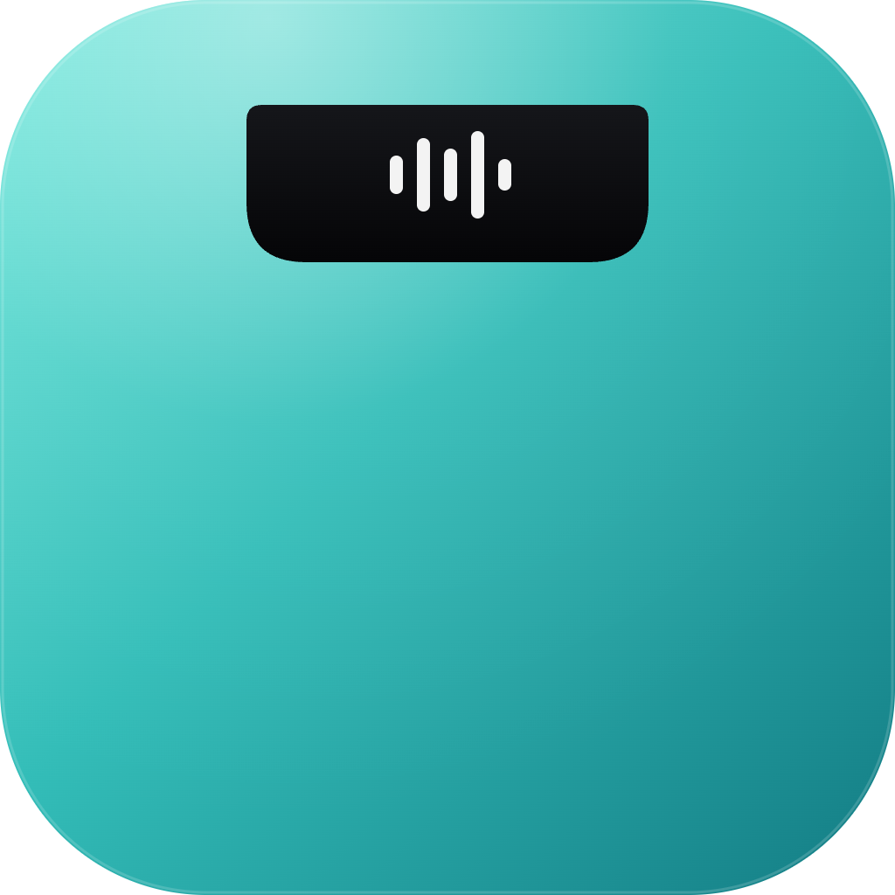

<p align="center">
  
</p>

<h1 align="center">NotchOS</h1>

<p align="center">
  Turn your MacBook's notch into a powerful command center.
</p>

<p align="center">
  
  
  
</p>

---

NotchOS transforms the MacBook notch from dead space into a dynamic hub — drop files, control music, check your calendar, jot quick notes, and more, all without leaving your workflow.

## Features

- **File Drop Zone** — Drag and drop files onto the notch for temporary storage. Click to open, option-click to delete. Configurable auto-expiry.
- **AirDrop Integration** — Instantly share dropped files via AirDrop from the notch.
- **Now Playing Controls** — View album art, track info, and control playback (play/pause, skip, seek) directly from the notch.
- **Calendar at a Glance** — See today's date and upcoming events without opening Calendar.
- **Quick Notes** — Jot down todos and notes in a lightweight checklist that lives in your notch.
- **Customizable Appearance** — Multiple notch styles (Opaque, Translucent, Material) to match your aesthetic.
- **Settings** — Language selection, launch at login, haptic feedback, and file storage duration.
- **Menu Bar Friendly** — Works alongside menu bar managers without conflicts.
- **Privacy Focused** — Fully open source. Your data stays on your Mac.

## Installation

### From Source

1. Clone the repository:
```bash
git clone https://github.com/ishan-crd/NotchOS.git
cd NotchOS
```

2. Open in Xcode:
```bash
open NotchOS.xcodeproj
```

3. Build and run (⌘R).

### Requirements

- macOS 14.5+
- Xcode 15.4+
- MacBook with a notch (works on all Macs, optimized for notch models)

## Usage

Once launched, NotchOS lives in your MacBook's notch area. Hover over the notch to expand it, revealing:

| Tab | What it does |
|-----|-------------|
| **Tray** | Drop files here for quick access and AirDrop sharing |
| **Music** | Now playing controls with album art and waveform visualizer |
| **Today** | Calendar view with upcoming events |
| **Notes** | Quick checklist for todos and reminders |
| **Settings** | Language, appearance, storage, and launch preferences |

## Acknowledgements

Built on top of [NotchDrop](https://github.com/Lakr233/NotchDrop) by [Lakr233](https://github.com/Lakr233). NotchOS extends the original with media controls, calendar integration, quick notes, and a redesigned UI.

## License

[MIT License](./LICENSE)
